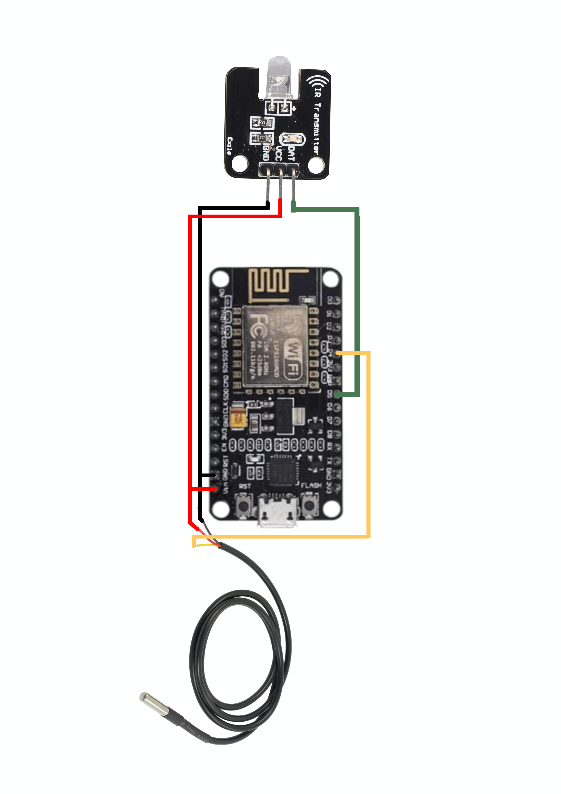
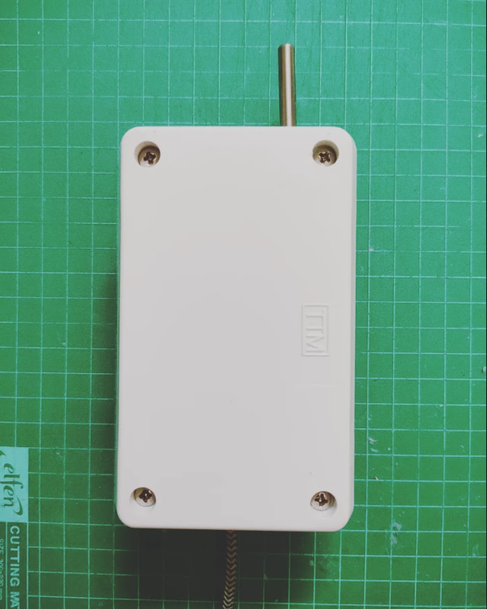

# 🕯️What can Remaote Air wifi do?
Can control to turn on/off the air conditioner or increase/decrease the temperature. You can view the temperature in real time. Via your mobile phone with the Blynk application, the temperature displayed is both C ํ , F ํ  .

   
  

